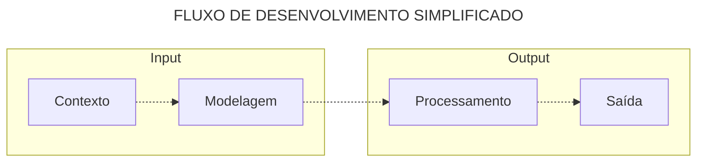

👋 Seja bem-vindo(a), Dev ou Tech Recruiter!  
Sou o **Thiago**, com experiência em **Tecnologia desde 2007**. 🤖

💼 Atualmente trabalho com a stack **.NET**, explorando as seguintes frentes:

🧠 **Planejamento e Arquitetura**
- 🧩 **Modelagem de domínio**, organização em camadas e aplicação de boas práticas (SOLID, Clean Architecture)  
- 🛡️ **Adoção de práticas de segurança**, com atenção à exposição de dados e validações  

🔧 **Backend e Integrações**
- 🔌 **Minimal APIs** para construção de APIs enxutas e performáticas  
- 🧭 **ASP.NET** em soluções web robustas com MVC e Razor  
- 🗄️ **Banco de dados** com SQL Server, utilizando procedures, views e queries otimizadas  
- 🔄 **Integração com APIs externas** e consumo de serviços REST  
- 🧳 **Migração e sustentação de sistemas existentes**, com foco em estabilidade e modernização  
- 🖥️ **Windows Forms** para manutenção e evolução de sistemas desktop legados  

🎨 **Frontend**
- 🎯 **Blazor** (WebAssembly e Server) para aplicações modernas e interativas  

🧪 **Testes e Qualidade**
- 🧪 **Testes automatizados** (unitários e integrados) para garantir confiabilidade  
- ⚙️ **Atenção à performance e experiência do usuário**, evitando complexidade desnecessária  

🚀 **Publicação e Versionamento**
- 🔀 **Versionamento e automações de deploy** com Git, Azure DevOps e GitHub Actions  

🧠 Acredito que o equilíbrio é a chave para soluções eficazes. O básico funciona — e tudo começa com **planejamento e arquitetura**.

🛠️ Encaro o desenvolvimento como um processo estruturado:
 1. **Entendimento do contexto**: Qual problema estamos resolvendo?  
 2. **Modelagem das entradas (inputs)**: Organização e estruturação das informações  
 3. **Processamento e entrega das saídas (outputs)**: Clareza, eficiência e propósito

🧹 Procuro aplicar uma **modelagem limpa**, com **boas práticas** e nomes expressivos para classes, propriedades e métodos.

📚 Me mantenho atualizado com os conteúdos do **balta.io** e **curso.dev**. 🌱  
🎓 Sou um eterno aprendiz e gosto de compartilhar o que descubro. 😎

📬 **Posso ajudar em algo?** É só chamar. ✌️

# 📫 Contato:

# 💻 Tech Stack:
![.NET] 
![C#]
![Blazor]
![Minimal APIs] 
![Entity Framework]
![Dapper]
![SQL Server]
![SQLite]
![Azure]
![CleanCode]
![KISS]
![SOLID]
![DI]
![Rich Domains]
![HTML5]
![CSS3]
![JavaScript]
![Bootstrap]
![Markdown] 
![Git] 
![MySQL]
![Postgres] 
![Oracle]
![Docker]
![Cloudflare] 
![Postman]
![ShellScript] 

# 🪄 Dev Tools:

- JetBrains Rider
- VS Code
- Visual Studio
- Azure Data Studio
- SQL Server Management Studio
- Notepad ++
- MongoDB Compass
- Docker Desktop

# 🎨Themes:

- [One Dark Pro](https://github.com/Binaryify/OneDark-Pro)
- [JetBrains Mono](https://www.jetbrains.com/pt-br/lp/mono/)

<!--- Badge Links --->
[.NET]: https://img.shields.io/badge/.NET-7e2bb3?style=for-the-badge&logo=.net&logoColor=white
[C#]: https://img.shields.io/badge/c%23-7e2bb3.svg?style=for-the-badge&logo=c-sharp&logoColor=white
[Blazor]: https://img.shields.io/badge/blazor-%237734bc.svg?style=for-the-badge&logo=blazor&logoColor=white
[Minimal APIs]: https://img.shields.io/badge/minimal%20apis-%237734bc.svg?style=for-the-badge&logo=minimal%20apis&logoColor=white

[Entity Framework]: https://img.shields.io/badge/entity%20framework-%236e3bc6.svg?style=for-the-badge&logo=entity%20framework&logoColor=white
[Dapper]: https://img.shields.io/badge/dapper-%236e3bc6.svg?style=for-the-badge&logo=dapper&logoColor=white
[SQL Server]: https://img.shields.io/badge/%20SQL%20Server-6443cf?style=for-the-badge&logo=microsoft%20sql%20server&logoColor=white
[SQLite]: https://img.shields.io/badge/sqlite-%236443cf.svg?style=for-the-badge&logo=sqlite&logoColor=white
[Azure]: https://img.shields.io/badge/azure-%23564ad8.svg?style=for-the-badge&logo=azure-devops&logoColor=white

[CleanCode]: https://img.shields.io/badge/cleancode-051937.svg?style=for-the-badge&logo=cleancode&logoColor=%2361DAFB
[KISS]: https://img.shields.io/badge/kiss-004d7a?style=for-the-badge&logo=kiss&logoColor=white
[SOLID]: https://img.shields.io/badge/solid-008793.svg?style=for-the-badge&logo=solid&logoColor=white
[DI]: https://img.shields.io/badge/di-00bf72.svg?style=for-the-badge&logo=di&logoColor=white
[Rich Domains]: https://img.shields.io/badge/rich%20domains-a8eb12.svg?style=for-the-badge&logo=rich%20domains&logoColor=white

[HTML5]: https://img.shields.io/badge/html5-%23d16ba5.svg?style=for-the-badge&logo=html5&logoColor=white
[CSS3]: https://img.shields.io/badge/css3-%23c777b9.svg?style=for-the-badge&logo=css3&logoColor=white
[JavaScript]: https://img.shields.io/badge/javascript-%23ba83ca.svg?style=for-the-badge&logo=javascript&logoColor=white
[Bootstrap]: https://img.shields.io/badge/bootstrap-%23aa8fd8.svg?style=for-the-badge&logo=bootstrap&logoColor=white
[Markdown]: https://img.shields.io/badge/markdown-9a9ae1?style=for-the-badge&logo=markdown&logoColor=white
[Git]: https://img.shields.io/badge/Git-da553a?style=for-the-badge&logo=git&logoColor=white

[MySQL]: https://img.shields.io/badge/mysql-%23e2763b.svg?style=for-the-badge&logo=mysql&logoColor=white
[Postgres]: https://img.shields.io/badge/postgres-%23e89443.svg?style=for-the-badge&logo=postgresql&logoColor=white
[Oracle]: https://img.shields.io/badge/Oracle-ebb252?style=for-the-badge&logo=oracle&logoColor=white
[Docker]: https://img.shields.io/badge/docker-%23edce69.svg?style=for-the-badge&logo=docker&logoColor=white
[Cloudflare]: https://img.shields.io/badge/Cloudflare-e8d86b?style=for-the-badge&logo=Cloudflare&logoColor=white
[Postman]: https://img.shields.io/badge/Postman-c4ea66?style=for-the-badge&logo=postman&logoColor=white
[ShellScript]: https://img.shields.io/badge/Shell%20Script-93e346?style=for-the-badge&logo=gnu-bash&logoColor=white
